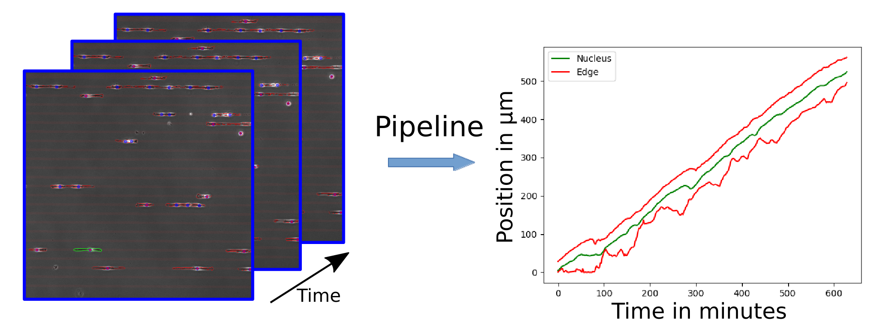

# Onedcelltrack



Python project for 1D automated single-cell migration assay. Pipeline which takes in a set of raw microscopy imaging data and creates 1D tracks for each detected cell's nucleus, rear and front position. The cells are first segmented using [cellpose](https://github.com/MouseLand/cellpose) and the fluorescently labeled nuclei are tracked using [trackpy](https://github.com/soft-matter/trackpy). The project also provides two different tools for visualising the data. Either in a jupyter notebook or as a website.

## Installation

### Getting the source code
```
git clone https://github.com/keejkrej/onedcelltrack.git
(or)
git clone https://gitlab.physik.uni-muenchen.de/LDAP_ls-raedler/onedcelltrack.git
cd onedcelltrack
```

### Configure the environment and install the package
```
conda create -n onedcelltrack python=3.12
conda activate onedcelltrack
pip install .
```

### Register the environment as a jupyter kernel
```
python -m ipykernel install --user --name onedcelltrack
```

## Running the pipeline
See the example [`run_pipeline.ipynb`](examples/run_pipeline.ipynb)

### Jupyterhub
Select the `onedcelltrack` kernel

## Viewing the results
See the example [`plot.ipynb`](examples/plot.ipynb)


